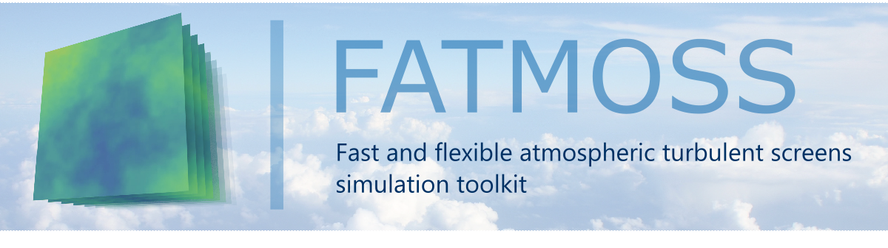

# FATMOSS
<!-- **Fast Atmospheric Turbulence Screens Simulator** -->
<p align="center">
    
<p>
A high-performance Python toolkit for FFT-based realistic atmospheric turbulence phase screens simulation using GPU or CPU.

## ► Features
- **Atmospheric layer simulation** supports multi-layer frozen-flow as well as boiling atmospheric evolution models
- **Flexible** accepts arbitrary PSD as input
- **Multi-cascade phase screen generation** for accurate outer scale and
- **GPU acceleration** support for high-performance computing
- **Batch processing** for efficient time-series generation
- **Reproducible results** with seeded random number generators


## ► Demo

<table align="center">
<tr>
<td align="center">
<h3>Frozen Flow Turbulence</h3>
<a href="./demo/frozen_flow_2layers.mp4" target="_blank">

</a>
<br>
<em>(wind_speed=40 m/s, boiling_factor=0, 2 layers)</em><br>
</td>
<td align="center">
<h3>Mixed Turbulence</h3>
<a href="./demo/frozen_and_boiling_1layer.mp4" target="_blank">

</a>
<br>
<em>(wind_speed=40 m/s, boiling_factor=500, 1 layer)</em><br>
</td>
<td align="center">
<h3>Pure Boiling</h3>
<a href="./demo/pure_boiling_1layer.webm" target="_blank">

</a>
<br>
<em>(wind_speed=0 m/s, boiling_factor=1500, 1 layer)</em><br>
</td>
</tr>
</table>

Click images above to view high-quality video

## ► Installation

### 1. Clone the Repository
```bash
git clone https://github.com/EjjeSynho/FATMOSS.git
cd FATMOSS
```

### 2. Install Dependencies
```bash
# Install core dependencies
pip install -r requirements.txt

# For GPU acceleration (optional but recommended)
# Choose based on your CUDA version:
pip install cupy-cuda11x  # For CUDA 11.x
# or
pip install cupy-cuda12x  # For CUDA 12.x
```

### 3. Configure GPU Settings
Edit `settings.json` to enable/disable GPU acceleration:
```json
{
    "use_GPU": true,
    "batch_size": 100
}
```
Adjust the `batch_size` parameter to optimize the balance between simulation performance and memory usage for your specific requirements.

## ► Usage

Check the `example.ipynb` to see the basic usage of the code.

## ► References

Check the `demo` folder for the poster with the references.

## 📁 Project Structure

```
FATMOSS/
├── phase_generator.py     # Main phase screen generator class
├── atmospheric_layer.py   # Atmospheric layer definitions
├── interpolate.py         # Screens upscaling utilities
├── misc.py                # Helper functions
├── example.ipynb          # Jupyter notebook examples
├── test.py                # Sandbox file
├── requirements.txt       # Python dependencies list
└── settings.json          # Default configuration file
```
